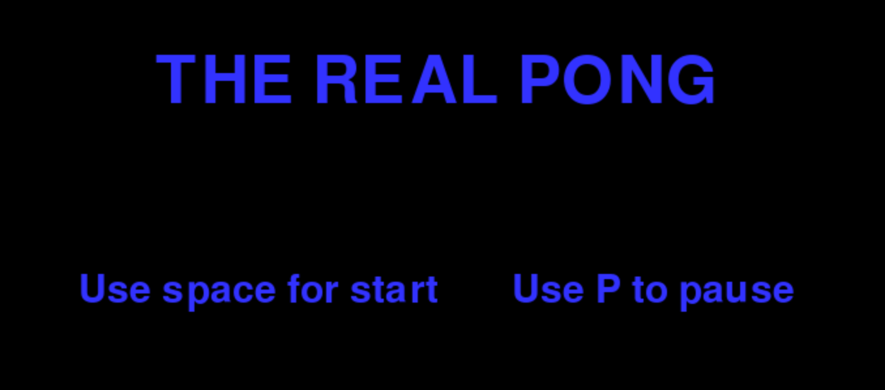
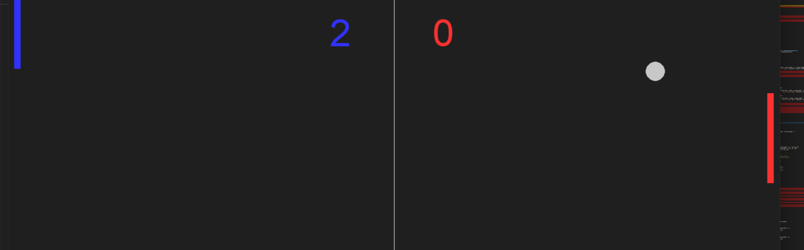
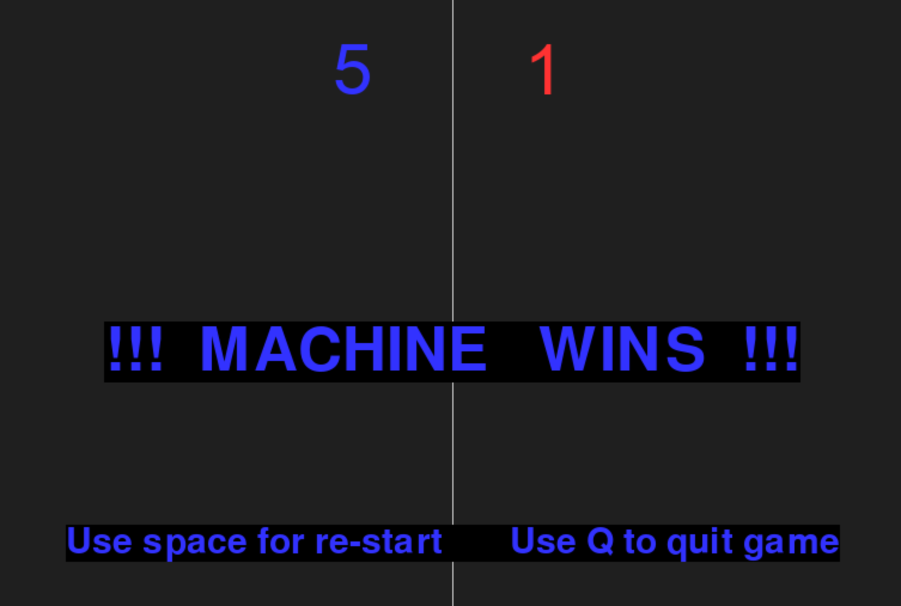

# El mítico Pong de Atari :rocket:

Este juego lo he realizado en una de las katas para el curso de programación desde cero en [GeeksHubsAcademy](https://geekshubsacademy.com/).

Se trata del famoso, simple y adictivo juego de Atari pong.
Podrás jugar solo en modo contra la máquina y el vencedor es el primero que llegue a 5 puntos.

Espero que lo disfrutes. Si te quieres entretener añadiendo la opción de dos jugadores tu aportación será bien recibida!!!